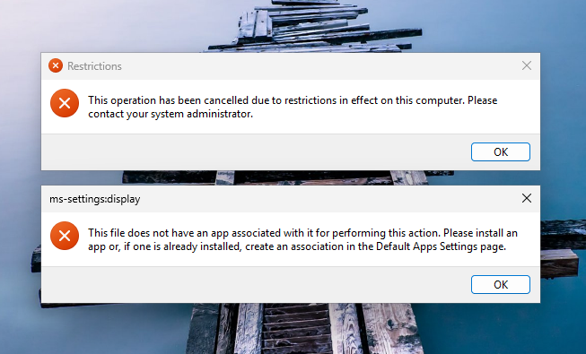

# 🧾 Report – Active Directory Infrastructure & Sysmon Monitoring

## 📌 Overview

This project involved deploying a secure environment using **Windows Server 2022**, including the following key services:

- Active Directory Domain Controller
- DNS and DHCP Server
- IIS Web Server for internal services
- System activity monitoring using **Sysmon**

Two users were created to simulate real-world access roles:

- **Alice** – Domain Administrator
- **Bob** – Standard User

---

## 🛠️ Implementation Summary

### 🧱 1. Infrastructure Setup
- Installation of **Windows Server 2022** inside a VirtualBox VM
- Roles installed:
  - Active Directory Domain Services
  - DNS Server
  - DHCP Server
  - Web Server (IIS)
- The server was promoted to a **domain controller**: `ecomdesign.local`

### 👥 2. User Management
- Created Organizational Units (OUs): `AdminUsers` and `StandardUsers`
- Created accounts:
  - `alice` (member of `Domain Admins`)
  - `bob` (standard user)

### 🛡️ 3. Group Policy Implementation (GPO)
- **GPO_StandardUsers**:
  - Control Panel access denied
  - Blocked execution of `cmd.exe`, `powershell.exe`, and `regedit.exe`
- **GPO_AdminUsers**:
  - Full access for Alice without restrictions

### 🌐 4. Network Configuration
- Automatic IP assignment using DHCP (range: `192.168.56.50 – 100`)
- DNS configured for the domain `ecomdesign.local`
- Network and DNS tests successful from the client (PC-Bob)

---

## 🔍 5. Sysmon Monitoring

### ✅ Installation
- Sysmon installed on the domain controller using:
  ```bash
  Sysmon64.exe -accepteula -i sysmonconfig-export.xml

## Configuration file

[SwiftOnSecurity/sysmon-config](https://github.com/SwiftOnSecurity/sysmon-config)

---

## 🧪 Simulated User Activities

### 🔸 Alice (Administrator)

- Ran PowerShell commands  
- Used administrative tools (DNS, DHCP, etc.)  
- Executed programs and accessed system files

### 🔸 Bob (Standard User)

- Attempted to run `cmd.exe` → **blocked**  
- Tried to open Control Panel → **denied**  
- Accessed his personal user folder only

---

## 🧾 Observed Logs

- **Event ID 1 – Process Creation**: logged commands executed by Alice  
- **Event ID 3 – Network Connections**: tracked outbound connections  
- **Event ID 11 – File Creation**: monitored file execution in user directories

---

## 🔐 Conclusion

This project demonstrates the ability to:

- Deploy a secure Windows Server infrastructure  
- Manage users and permissions using Active Directory  
- Apply precise Group Policy Objects based on roles  
- Monitor system activity effectively using Sysmon



