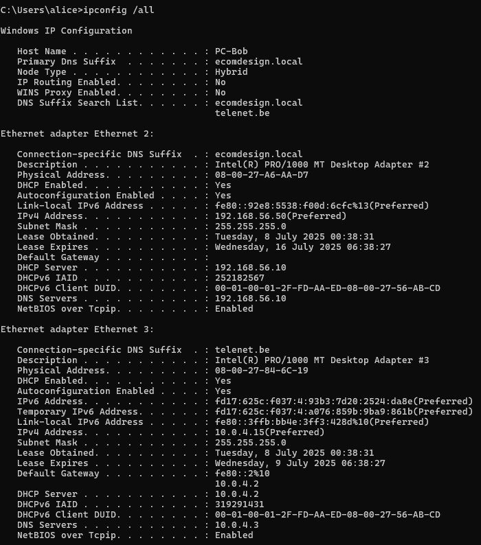

# 🧾 Report – Active Directory Infrastructure & Sysmon Monitoring

## 📌 Overview

This project involved deploying a secure environment using **Windows Server 2022**, including the following key services:

- Active Directory Domain Controller  
- DNS and DHCP Server  
- IIS Web Server for internal services  
- System activity monitoring using **Sysmon**

Two users were created to simulate real-world access roles:

- **Alice** – Domain Administrator  
- **Bob** – Standard User

---

## 🛠️ Implementation Summary

### 🖥️ 0. Virtual Machines Setup

- Created VMs using **VirtualBox**:
  - **Server-AD** VM running Windows Server 2022  
  - **PC-Bob** VM running Windows 11 client  
- Configured VM networking with:
  - Host-only adapter for internal domain communication  
  - NAT adapter for internet access (Windows Update)  

### 🧱 1. Infrastructure Setup

- Installed Windows Server 2022 on Server-AD  
- Installed roles:  
  - Active Directory Domain Services (AD DS)  
  - DNS Server  
  - DHCP Server  
  - Web Server (IIS)  
- Promoted Server-AD as domain controller for domain `ecomdesign.local`  

### 👥 2. User Management

- Created Organizational Units (OUs): `AdminUsers` and `StandardUsers`  
- Created users:  
  - `alice` (Domain Admin)  
  - `bob` (standard user)  

### 🛡️ 3. Group Policy Implementation (GPO)

- **GPO_StandardUsers**:  
  - Disabled Control Panel access  
  - Blocked `cmd.exe`, `powershell.exe`, `regedit.exe`  
- **GPO_AdminUsers**:  
  - Full unrestricted access for Alice  

### 🌐 4. Network Configuration

- Configured DHCP scope: `192.168.56.50` to `192.168.56.100`  
- Set DNS server to `192.168.56.10` (domain controller)  
- Verified IP and DNS assignment on PC-Bob via DHCP  

---

## 🔍 5. Sysmon Monitoring

### ✅ Installation

- Downloaded Sysmon from Sysinternals  
- Used configuration file: [SwiftOnSecurity/sysmon-config](https://github.com/SwiftOnSecurity/sysmon-config)  
- Installed Sysmon on domain controller:

```powershell
Sysmon64.exe -accepteula -i sysmonconfig-export.xml
```


## Configuration file

[SwiftOnSecurity/sysmon-config](https://github.com/SwiftOnSecurity/sysmon-config)

---

## 🧪 Simulated User Activities

### 🔸 Alice (Administrator)

- Ran PowerShell commands  
- Used administrative tools (DNS, DHCP, etc.)  
- Executed programs and accessed system files

### 🔸 Bob (Standard User)

- Attempted to run `cmd.exe` → **blocked**  
- Tried to open Control Panel → **denied**  
- Accessed his personal user folder only

---

## 🧾 Observed Logs

- **Event ID 1 – Process Creation**: logged commands executed by Alice  
- **Event ID 3 – Network Connections**: tracked outbound connections  
- **Event ID 11 – File Creation**: monitored file execution in user directories

---

## 🔐 Conclusion

This project demonstrates the ability to:

- Deploy a secure Windows Server infrastructure  
- Manage users and permissions using Active Directory  
- Apply precise Group Policy Objects based on roles  
- Monitor system activity effectively using Sysmon


## 📸 Attachments

### Screenshot: IP address assigned by DHCP



---

### Screenshot: Bob blocked from opening CMD


---

### Screenshot: Sysmon logs in Event Viewer


